# Exercício bash

### Criando e deletando pastas e arquivos pelo terminal Git Bash

Esse exercício foi copiado da [Turma Online 3](https://github.com/reprograma/On3-git-e-github/tree/master/1-exercicio-bash)

Com essa apresentação: (on3-git-bash)[https://docs.google.com/presentation/d/16kA4w6qWRxqm4Z5ZlsopA1a8pKXSPaO4mKcVuUcoc7g/edit#slide=id.p] 

Você deve ter instalado o Git na sua máquina. Na Área de Trabalho (Desktop), clique com o botão direito e selecione Git Bash here

Este é o Git Bash. É como um terminal. Então, executamos ações por meio de instruções de linha de comando. Seguem abaixo algumas ações básicas para nos habituarmos com o terminal Git Bash:

- [Verificar o caminho onde se encontra](#verificar-o-caminho-onde-se-encontra)
- [Listar o que tem nesse lugar](#listar-o-que-tem-nesse-lugar)
- [Criar uma nova pasta](#criar-uma-nova-pasta)
- [Navegar pela pasta](#navegar-pela-pasta)
- [Criar um arquivo dentro dessa pasta](#criar-um-arquivo-dentro-dessa-pasta)
- [Deletar o arquivo](#deletar-o-arquivo)
- [Deletar a pasta](#deletar-a-pasta)

Abrindo o `git bash`:

#### Verificar o caminho onde se encontra

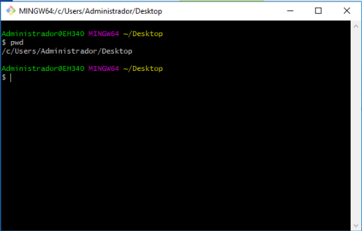

#### Listar o que tem nesse lugar

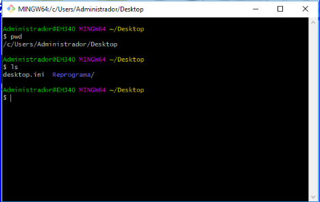

#### Criar uma nova pasta

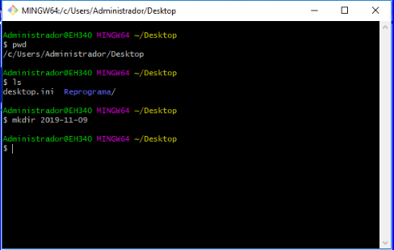

e verificar que a pasta foi criada, nesse exemplo foi criada no Desktop e podemos visualizar:

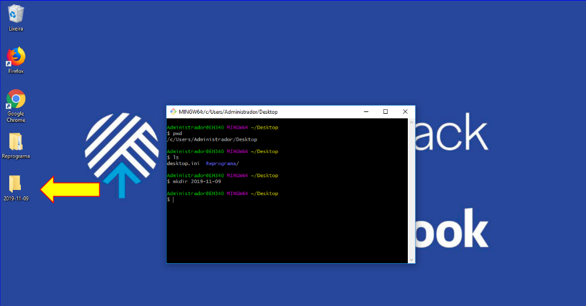

E também verificar com o `ls`:

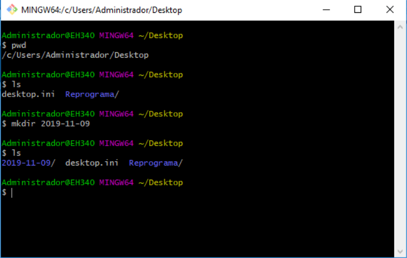

#### Navegar pela pasta

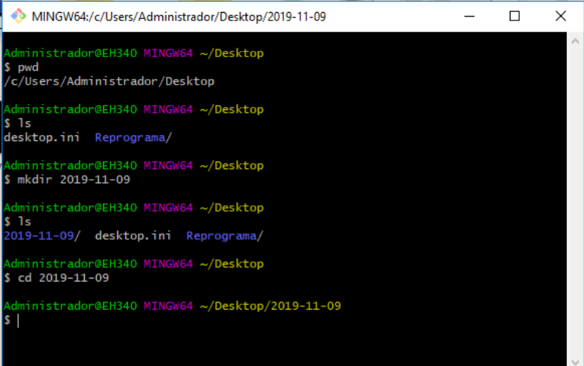

#### Criar um arquivo dentro dessa pasta

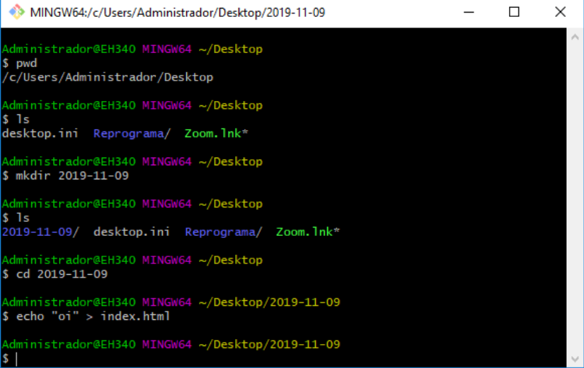

e verificar que o arquivo foi criado, podemos visualizar:

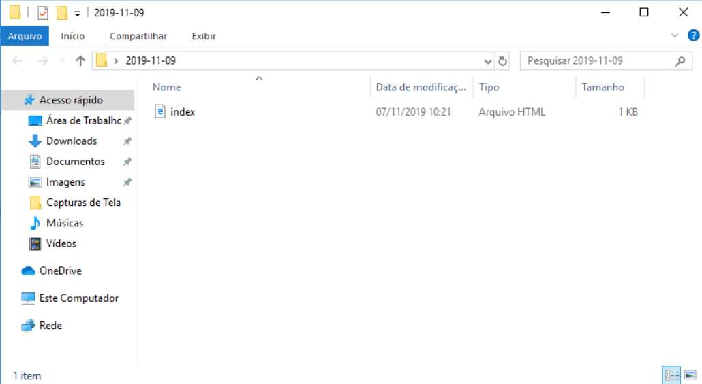

E também verificar com o `ls`:

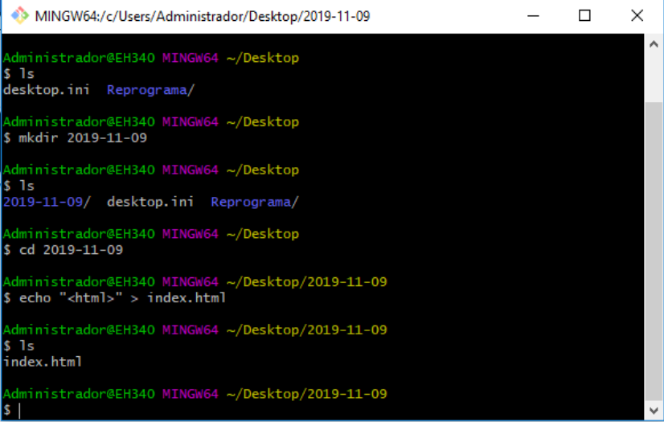

#### Deletar o arquivo

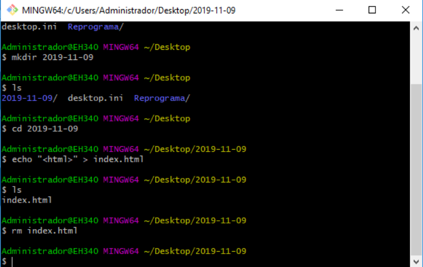

E verificar que o arquivo foi deletado, nesse exemplo podemos visualizar:

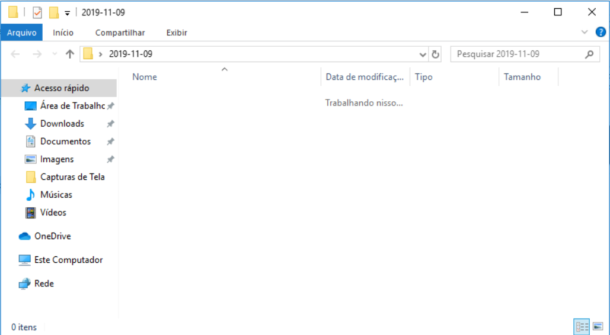

E também verificar com `ls`:

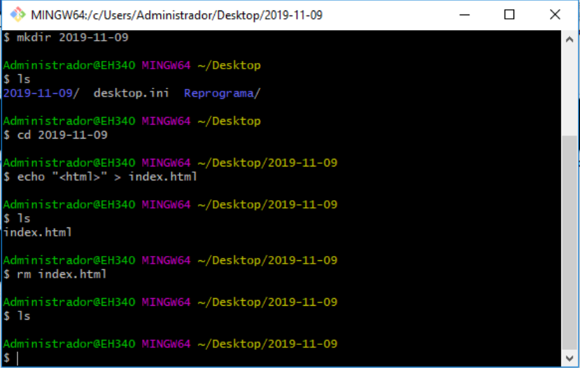

#### Deletar a pasta
Voltar uma pasta:

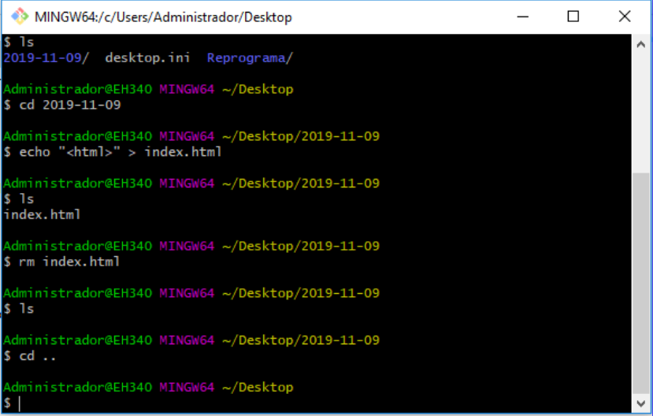

Verificar as pastas existentes:

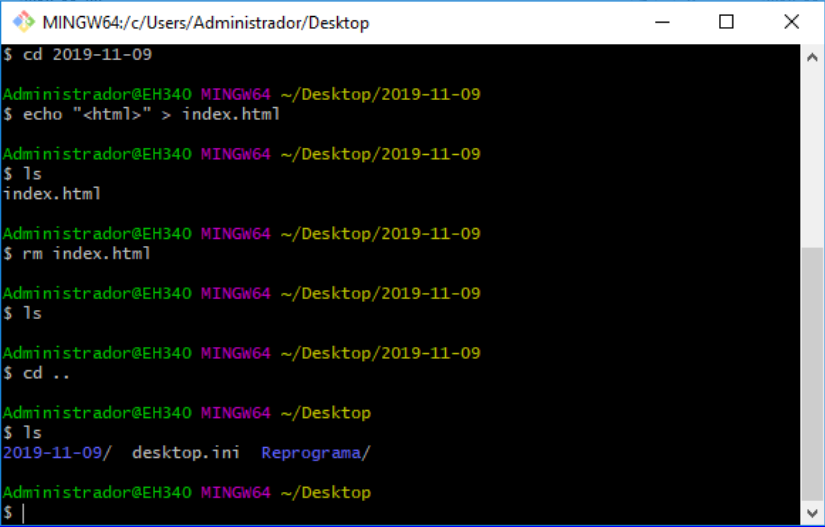

Executar o comando para remover:

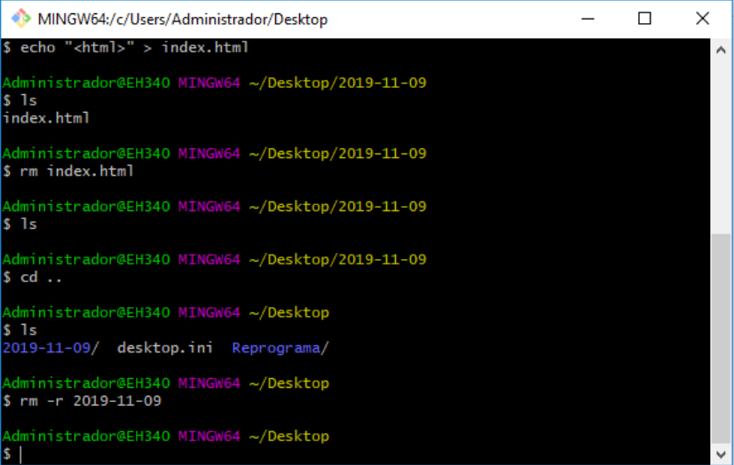

Verificar se a pasta foi removida:

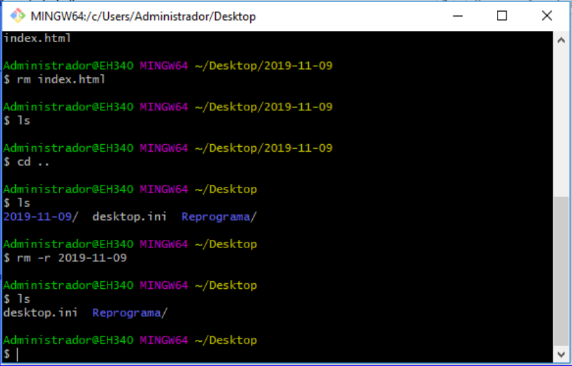

[<- Sobre linha de comando](../sobre-linha-de-comando.md) | [Sobre Github ->](../sobre-github.md)