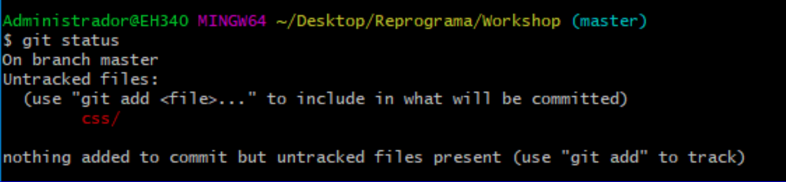
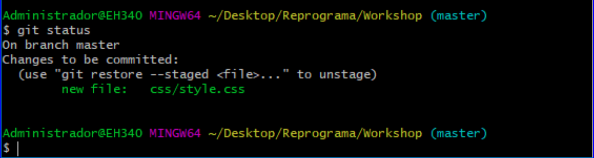

[<- Início](../../README.md)

Seguir a <a href="https://docs.google.com/presentation/d/1XNoWxZekQSUR9kwQHI8ffWd4x_PkPEAVPVXjse3NSTI/edit?usp=sharing" target="_blank">APRESENTAÇÃO</a>

### Rastreando seu projeto localmente e subindo para o GitHub

Seus dados devem estar previamente configurados no Git da sua máquina.
Verifique se seu **user.name** e **user.email** estão configurados:
- `git config --list`

Comandos para rastrear localmente um projeto:
- Entrar no Git Bash clicando com o botão direito do mouse de dentro da sua pasta (*Git Bash here*) ou navegando pelo Git Bash até a pasta desejada (`cd nomeDaPasta`).
- `git init`: iniciar o rastreamento dessa pasta
- `git add <nome do arquivo>` ou `git add --all` ou `git add .`: adicionar os arquivos na área de preparação
- `git commit -m "Mensagem de bom senso"`: adicionar a mensagem do que foi feito nesse(s) arquivo(s) adicionado(s)

Enviar o seu repositório local para um site de hospedagem de repositórios (ex: [GitHub](https://github.com)):
- Criar um repositório novo no site do GitHub https://github.com/new
- Voltar para o Git Bash dentro da pasta
- `git remote add origin https://github.com/<seuLogin>/<seuRepositorio>.git`: adicionando o endereço do repositório remoto
- `git push -u origin master`: enviando o que está no Git local para o GitHub

**Extra**
Caso precise mudar o endereço do seu repositorio online é só dar
`git remote --set-url origin novaURL`

**OBS1**: Caso utilize `git status` após um commit bem sucedido aparecerá esse aviso:

Esse aviso não é um erro, é apenas o git informando que a sua branch está atualizada e em sincronia e que não existem arquivos novos ou atualizados para registrar mudanças, ou seja, sem necessidade de passar pelo fluxo de adição e commit :).

**OBS2**: Antes de dar o `git push` sempre lembrem de dar git status para verificar que não ficou nenhum arquivo para tras, caso tenha algum `untracked files`, ou seja, que não foi adicionado na área de preparação(staging area):

Será necessário verificar se quer adicionar esse arquivo ao commit, caso queira, é só utilizar o comando `git add .`(para adicionar todos os arquivos com modificação) ou `git add <arquivo desejado>`(para adicionar apenas o arquivo com modificação desejado) e logo em seguida `git commit -m "Mensagem desejada"`.

Ou:
caso tenha algum arquivo com `changes to be committed`, ou seja, que já estão na área de preparação(staging area), porém não receberam o commit para concluir o registro das mudanças nesses arquivos:

é só utilizar o comando `git commit -m "Mensagem desejada"`

**OBS3**: Ao dar git push pode ser que ocorra esse erro:

**OBS3**: Ao dar git push pode ser que ocorra esse erro:

Esse erro signigica que algumas modificações foram adicionadas a essa branch no nosso repositorio online antes da nossa e que para enviar a nossa devemos manter atualizada antes, dando `git pull origin <nome-da-branch>`.
Ao fazermos git pull, ele já gera uma mensagem para o commit automaticamente, que é essa "Merge branch `'branch no git pull'` of `link do repositorio online no github` into `branch local`"

esse git pull pode gerar conflitos e para resolvê-los podemos consultar como no [material sobre conflitos](8-exercicio-conflito/README.md):

[<- Voltar para fluxo de trabalho](../sobre-fluxo-de-trabalho.md)
