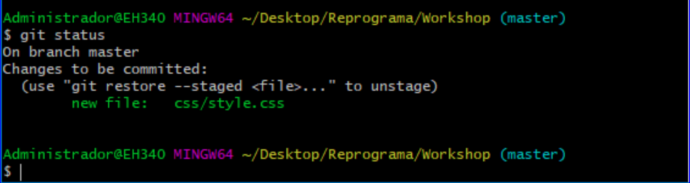

[<- Início](../../../README.md)


Seguir a <a href="https://docs.google.com/presentation/d/1pRanz7839_C3YdbIh9DT30giR-WrDWwxGEzkj3QXKuc/edit?usp=sharing" target="_blank">APRESENTAÇÃO</a>

### Contribuindo com um projeto da Reprograma
- Entrar o repositório do projeto da Reprograma: https://github.com/reprograma/On5-git-e-github
- Copiar o link HTTP que aparece ao clicar no botão verde ***Clone or download***.
- Na sua máquina: abrir o Git Bash clicando com o botão direito do mouse de dentro da pasta onde deseja clonar o repositório (*Git Bash here*), ou navegando pelo Git Bash até a pasta desejada (`cd nomeDaPasta`).
- `git clone https://github.com/reprograma/On5-git-e-github.git`
- `cd On5-git-e-github`: para entrar na pasta.
- `ls`: para listar o que tem dentro da pasta.
- `git branch -a`: para listar as branch's que tem nesse projeto.
- `git checkout -b ex-aula-seuNome`: para ir para uma branch nova chamada ex-aula-seuNome.
- `code .`: para abrir o VSCode nessa pasta.
- Abrir o arquivo `index.html` da pasta `5-exercicio-projeto-aula` no seu navegador (Chrome).
- No VSCode, verificar se está na sua branch pela parte inferior esquerda do VSCode.
- Alterar o código colocando `seu login GitHub` na `<td>` abaixo do seu nome.
  Exemplo:

  **Antes:**
```
  <tr>
    <td>Lydia Rodrigues</td>
    <td>seu login do GitHub</td>
  </tr>
```

  **Depois**
```
  <tr>
    <td>Lydia Rodrigues</td>
    <td>MaichiLydia</td>
  </tr>
```
- Salve a alteração e verifique no navegador se está correto.
- Volte para o Git Bash dentro dessa pasta.
- `git diff`: verique o que foi modificado.
- `git status`: verifique o status do repositório atual.
- `git add --all`: adicione todos os arquivos que foram modificados.
- `git commit -m "Mensagem de bom senso"`: adicionando a mensagem do que foi modificado.
- `git remote -v`: verifique se o endereço do repositório remoto. (Neste caso, o endereço do remoto chamado `origin` já veio quando você fez o clone do repositório).
- `git push origin ex-aula-seuNome`: envie para o repositório remoto as alterações da branch `ex-aula-seuNome`.
- Verifique no GitHub se sua alteração foi enviada com sucesso. Veja se sua branch está no repositório: https://github.com/reprograma/On5-git-e-github
- Clicar na aba **Pull requests** do repositório no GitHub.
- Clicar em **Compare & pull request** e verifique as alterações no código.
- **base: master <= compare: ex-aula-seuNome**: Criar o **pull request** verificando se está indo da sua branch `ex-aula-seuNome` para a branch master.
- Solicitar a revisão de código para a professora **MaichiLydia**.
- Aguardar a aprovação da sua solicitação.
- A professora fará o **merge** da sua branch `ex-aula-seuNome` para a `master`.

**OBS1**: Caso utilize `git status` após um commit bem sucedido aparecerá esse aviso:


Esse aviso não é um erro, é apenas o git informando que a sua branch está atualizada e em sincronia e que não existem arquivos novos ou atualizados para registrar mudanças, ou seja, sem necessidade de passar pelo fluxo de adição e commit :).

**OBS2**: Antes de dar o `git push` sempre lembrem de dar git status para verificar que não ficou nenhum arquivo para tras, caso tenha algum `untracked files`, ou seja, que não foi adicionado na área de preparação(staging area):


Será necessário verificar se quer adicionar esse arquivo ao commit, caso queira, é só utilizar o comando `git add .`(para adicionar todos os arquivos com modificação) ou `git add <arquivo desejado>`(para adicionar apenas o arquivo com modificação desejado) e logo em seguida `git commit -m "Mensagem desejada"`.

Ou:
caso tenha algum arquivo com `changes to be committed`, ou seja, que já estão na área de preparação(staging area), porém não receberam o commit para concluir o registro das mudanças nesses arquivos:



é só utilizar o comando `git commit -m "Mensagem desejada"`

**OBS3**: Ao dar git push pode ser que ocorra esse erro:


Esse erro signigica que algumas modificações foram adicionadas a essa branch no nosso repositorio online antes da nossa e que para enviar a nossa devemos manter atualizada antes, dando `git pull origin <nome-da-branch>`.
Ao fazermos git pull já gera uma mensagem para o commit automaticamente, que é essa
- "Merge branch `'branch no git pull'` of `link do repositorio online no github` into `branch local`" e pode ser que ele caía nessa tela:


Para sair dela é necessário digitar `:wq` ou caso abra no vscode: salvar e fechar.

O git pull pode gerar conflitos e para resolvê-los podemos consultar como no [material sobre conflitos](../8-exercicio-conflito/README.md)


[<- Voltar para fluxo de trabalho](../../sobre-fluxo-de-trabalho.md)
